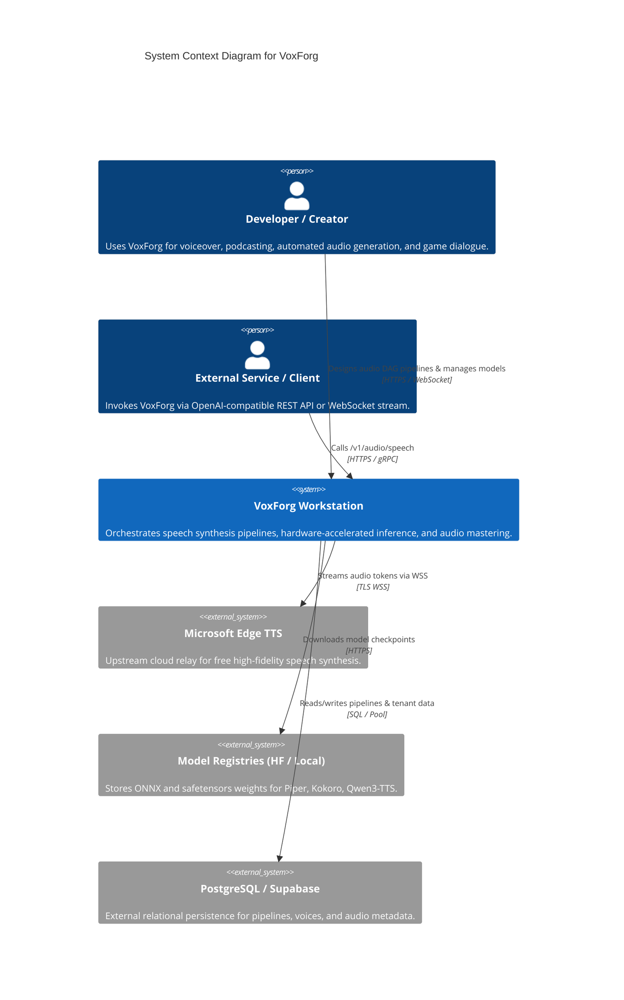
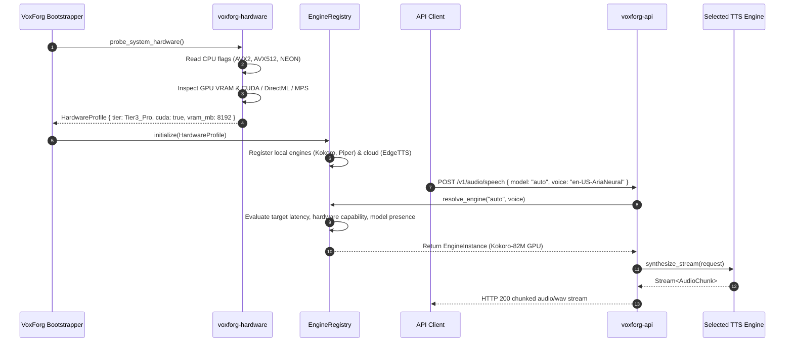
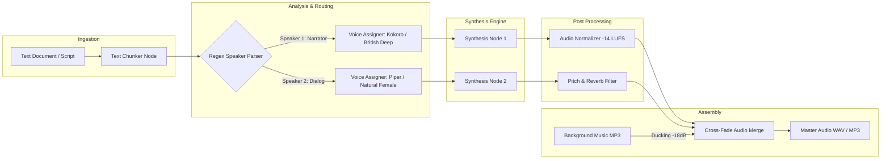
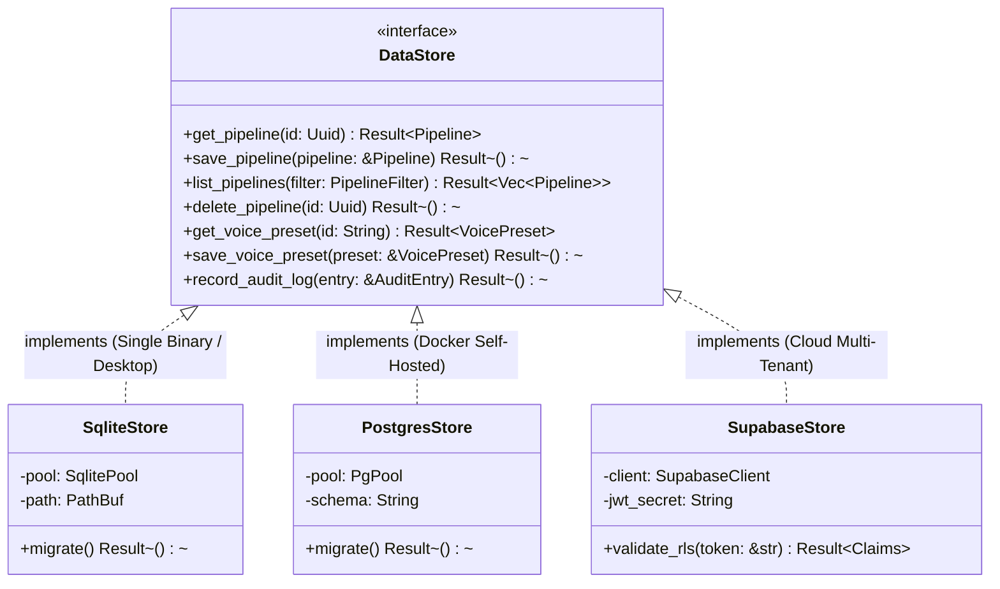
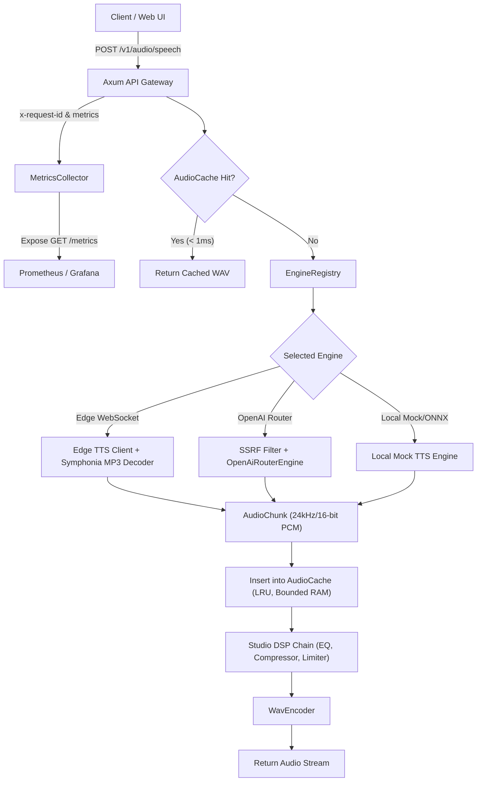

# VoxForg Architecture Specification

**Version:** 1.0.0  
**Status:** Stable / Active  
**Author:** VoxForg Core Engineering  

---

## 1. System Overview

VoxForg is an open-source, modular, hardware-adaptive speech synthesis server and visual workflow orchestration platform. The system operates in three deployment topologies:
1. **Single Binary Embedded**: Single executable with integrated SQLite database and embedded static UI bundle.
2. **Containerized Cluster**: Multi-container Docker / Kubernetes deployment with PostgreSQL persistence and Redis task queue.
3. **Native Desktop**: Cross-platform desktop runtime powered by Tauri v2 with OS native file system access and system audio sink.

---

## 2. C4 Architectural Views

### 2.1 C4 Level 1: System Context Diagram



---

### 2.2 C4 Level 2: Container Architecture Diagram

```mermaid
C4Container
    title Container Diagram for VoxForg

    Container(web_ui, "Web UI / Desktop Frontend", "React 19, TypeScript, Tailwind CSS", "Visual node-based DAG builder, voice playground, and telemetry dashboard.")

    Container_Boundary(core_boundary, "VoxForg Core Daemon (Rust)")
        Container(api_server, "API Gateway", "Axum 0.8, Tower, Hyper", "Handles HTTP REST routes, OpenAI /v1/audio/speech compatibility, CORS, and auth.")
        Container(pipeline_runner, "Pipeline DAG Runner", "Rayon, Tokio", "Compiles node graph, executes topological sort, schedules parallel node tasks.")
        Container(engine_dispatcher, "Engine Scheduler", "Rust async trait", "Routes audio requests to appropriate TTS engine based on hardware tier.")
        Container(audio_processor, "Audio Engine", "Symphonia, Rubato, Hound", "Performs resample, normalization, stereo panning, and format encoding (WAV/MP3/Opus).")
        Container(hardware_probe, "Hardware Probe", "Sysinfo, Windows API / sysfs", "Detects CPU features (AVX2, NEON), RAM, and GPU accelerators (CUDA/MPS).")
        Container(data_layer, "Persistence Abstraction", "SQLx / Rusqlite", "Tri-tier storage layer implementing the DataStore trait.")
    Container_Boundary_End()

    ContainerDb(sqlite_db, "SQLite Database", "Embedded disk storage", "Stores user settings, pipeline graphs, and voice presets in single-binary mode.")
    ContainerDb(pg_db, "PostgreSQL Database", "External server", "Stores cluster state and multi-tenant audio job queues.")

    Rel(web_ui, api_server, "Interacts via REST & WS", "JSON / Binary stream")
    Rel(api_server, pipeline_runner, "Dispatches execution job", "In-memory channel")
    Rel(api_server, engine_dispatcher, "Direct speech synthesis", "Async method call")
    Rel(engine_dispatcher, hardware_probe, "Queries available hardware tier", "Atomic read")
    Rel(pipeline_runner, audio_processor, "Pipes raw audio buffers", "Ring buffer")
    Rel(api_server, data_layer, "Reads/writes entities", "DataStore trait")
    Rel(data_layer, sqlite_db, "Queries / Migrations", "WAL SQLite connection")
    Rel(data_layer, pg_db, "Queries / Migrations", "SQLx connection pool")
```

---

### 2.3 C4 Level 3: Internal Component Architecture

The daemon is structured into clean, decoupled Rust crates inside a virtual workspace:

```
crates/
├── voxforg-core
│   ├── src/models/        # Domain entities: Voice, Engine, Pipeline, Node, Edge
│   ├── src/store/         # DataStore trait, SqliteStore, PostgresStore
│   ├── src/error/         # Unified VoxForgError with RFC 7807 problem details
│   └── src/auth/          # API key validation, token bucket rate limiter
├── voxforg-hardware
│   ├── src/probe.rs       # OS-level hardware detection (CPU features, RAM, GPU)
│   ├── src/profile.rs     # HardwareProfile and HardwareTier definitions
│   └── src/allocator.rs   # Engine recommendation matrix
├── voxforg-engine
│   ├── src/traits.rs      # TtsEngine trait & EngineCapabilities for routing
│   ├── src/registry.rs    # Thread-safe EngineRegistry with LRU audio cache
│   ├── src/edge_tts/      # Microsoft Edge TTS WebSocket client
│   ├── src/router.rs      # OpenAI-compatible pass-through engine
│   └── src/mock.rs        # Deterministic synthetic engine for tests
├── voxforg-router         # [Phase 2A] SLA-policy-based engine selection
│   ├── src/policy.rs      # SynthesisPolicy, VoiceStyle, RoutingDecision types
│   ├── src/scorer.rs      # Weighted multi-objective engine scoring algorithm
│   └── src/router.rs      # VoiceRouter: scores engines, health-checks, falls back
├── voxforg-pronunciation  # [Phase 2C] Pre-synthesis text normalization
│   ├── src/dictionary.rs  # Thread-safe runtime-editable custom pronunciation dict
│   ├── src/normalizer.rs  # Symbol/currency/scale-suffix/percent normalization
│   └── src/processor.rs   # PronunciationProcessor: chain entry point
├── voxforg-audio
│   ├── src/wav.rs         # Zero-allocation streaming WAV chunker
│   ├── src/resample.rs    # Sample rate conversion (e.g. 24kHz to 48kHz)
│   ├── src/normalizer.rs  # EBU R128 loudness normalization
│   └── src/concat.rs      # Cross-fade and pause insertion
├── voxforg-pipeline
│   ├── src/graph.rs       # Directed Acyclic Graph validator and topological sorter
│   ├── src/nodes/         # Node implementations (Text, Chunker, Voice, Filter, Output)
│   └── src/executor.rs    # Parallel async execution engine
├── voxforg-api
│   ├── src/routes/        # /v1/audio/speech, /v1/models, /v1/voices, /v1/pipeline,
│   │                      # /v1/pronunciation/dictionary
│   ├── src/middleware/    # Strict CORS, security headers, rate limiting
│   └── src/server.rs      # Axum HTTP/WS server bootstrap
└── voxforg-cli
    └── src/main.rs        # CLI entry point (serve, synth, probe, bench)
```

---

## 3. Hardware Probing & Engine Dispatch Lifecycle

VoxForg inspects host hardware at boot and continuously balances synthesis workloads:



---

## 4. Pipeline Execution Graph (DAG)

Visual workflows in VoxForg are represented as Directed Acyclic Graphs:



---

## 5. Storage Abstraction Layer

VoxForg implements a clean storage boundary via the `DataStore` trait to support single-binary, self-hosted, and cloud deployments without code divergence:



---

## 6. Security & Hardening Architecture

1. **Zero Credential Exposure & Secret Scrubbing**:
   - Upstream API keys (OpenAI router, cloud providers) are never sent to or stored in client-side code.
   - Keys are masked in server-side logs and tracing spans (`sk-***1234`).
   - RFC 7807 `ProblemDetails` error payloads strictly redact authorization tokens and headers.

2. **Server-Side Request Forgery (SSRF) Defense**:
   - All router URLs are parsed and checked against cloud instance metadata endpoints (`169.254.169.254`, `metadata.google.internal`) and link-local IPv6 (`fe80::/10`).
   - Private subnets (`10.0.0.0/8`, `172.16.0.0/12`, `192.168.0.0/16`) are blocked by default unless explicit permission is granted via `--allow-private-ips`.

3. **Denial-of-Service & Input Boundary Caps**:
   - `DefaultBodyLimit::max(2 * 1024 * 1024)` limits incoming request sizes to 2MB.
   - Text synthesis length is capped at 10,000 characters per request with RFC 7807 (HTTP 422 Unprocessable Entity) rejection.
   - Speed (0.25 to 4.0) and pitch (-50.0 to 50.0 semitones) are clamped to prevent digital filter blowups.

4. **Circuit Breakers & Exponential Backoff**:
   - Upstream router connections implement a 5-failure threshold circuit breaker that trips for 30s to prevent request pileup.
   - Transient 5xx server errors trigger up to 2 retries with jittered exponential backoff.

5. **Defense-in-Depth HTTP Headers**:
   - `Content-Security-Policy: default-src 'self'` (scoped CDN allowlists for interactive Scalar docs)
   - `X-Content-Type-Options: nosniff`
   - `X-Frame-Options: DENY` (or `SAMEORIGIN` for `/docs`)
   - `Strict-Transport-Security: max-age=31536000; includeSubDomains`
   - `Referrer-Policy: strict-origin-when-cross-origin`

---

## 7. Audio Synthesis Caching & Observability Architecture



1. **In-Memory Audio LRU Cache**:
   - Hash key: SHA-256 of `(engine_id, voice_id, speed, pitch, text)`.
   - Bounded memory footprint (default 500 items).
   - Serves repeated prompt requests in `< 1ms` with zero CPU/network cost.

2. **Zero-Dependency Prometheus Exporter (`GET /metrics`)**:
   - Reports `voxforg_requests_total{endpoint, status}`, `voxforg_synthesis_duration_seconds_total`, `voxforg_audio_samples_total`, `voxforg_cache_hits_total`, `voxforg_cache_misses_total`, and `voxforg_active_requests`.
   - Fully compatible with Prometheus, VictoriaMetrics, and Datadog agents.

